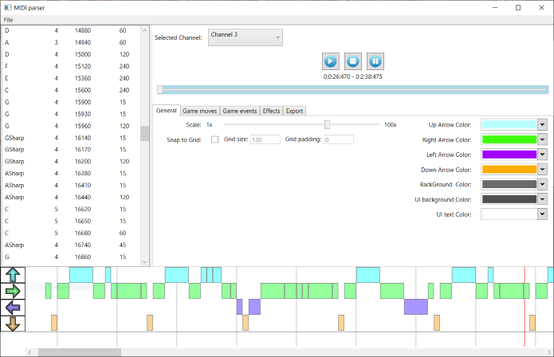
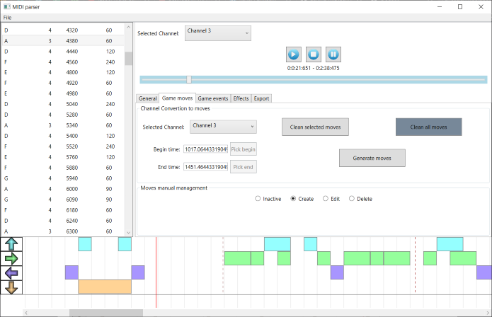

# MIDIparser
A WPF application to generate levels for my Unity project - Dancer

Game repository:

https://github.com/JakubStrekowski/Dancer

Features:
- Listen to MIDI file by all channels or select a separate one
- Generate moves based on selected channel for a whole song or for a selected period of time
- Freely add and delete your own moves, you can also set a modifiable grid for precise positioning
- Modify colors of ingame UI and background for this level
- Add sprites during gameplay, move them and change their color over time
- Add preview image and music player during gameplay (can be different than loaded MIDI, but still should have the same tempo. Easiest way is to convert MIDI to wav)

After clicking 'Export' button in export tab a folder with the same name as the song title will be created. It will be in CreatedMusicLevels directory.
In order to add this level to the game simply copy and paste level into the 'Dancer_Data/Resources/Music' directory of the game.

If a new level folder is named 'Test1' and a game is installed in 'C:/Program Files' then the directory of a pasted level would be:

'C:/Program Files/Dancer/Dancer_Data/Resources/Music/Test1'
